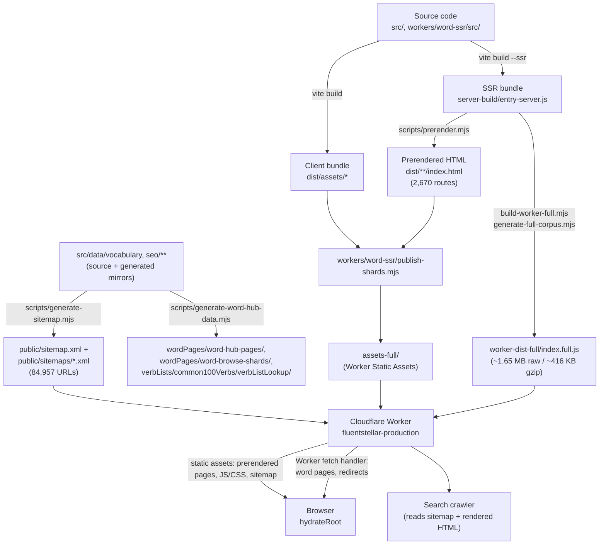

# FluentStellar Architecture

This is the orientation document for the repository — it explains how the
pieces fit together and links to the specialized ownership docs for detail.
It does not duplicate their content.

Structural claims (rendering paths, ownership boundaries, guard behavior)
are kept current by `test:architecture-documentation` and the other
architecture guards below. Specific counts (prerendered routes, sitemap
URLs, Worker bundle size) are point-in-time measurements, not permanent
invariants — each is labeled inline as a measured baseline; re-verify them
from the commands cited next to each figure rather than trusting the number
itself to stay accurate.

## System overview

FluentStellar is a React 18 + Vite + TypeScript single-page app with two
complementary rendering strategies layered on top of it:

1. **Build-time prerendering (SSG)** — `npm run build` renders a fixed set
   of routes (home, language/level/category/exercise selection, practice,
   about/help, the CEFR vocabulary-level pages, SEO hub pages, level-test
   SEO pages, verb-list pages) to static `index.html` files under `dist/`.
   These ship as Cloudflare Static Assets and are served with no server
   code running.
2. **Runtime SSR in a Cloudflare Worker** — the much larger set of
   individual word pages (one per vocabulary word × UI language) is too
   large to prerender (see [Prerendering vs. sitemap](#prerendering-vs-sitemap)
   below) and is rendered on request by `workers/word-ssr/`, using the same
   `src/entry-server.tsx` `render()` function the prerender script uses.

Both paths produce complete server-rendered HTML (not a bare `<div id="root">`
shell); the browser then hydrates onto whichever one it received. There is
no client-only-rendered indexable route.

Vercel and GitHub Pages were both retired; Cloudflare is the sole production
platform. See [`docs/deployment.md`](deployment.md) for the authoritative,
continuously-reverified deployment/runtime record — this document explains
architecture and ownership, that one explains current production behavior
and status.

## Request and rendering paths

- **Static assets** (`/assets/*.js`, `/assets/*.css`, images, fonts,
  `robots.txt`, `sitemap.xml`) — served directly by Cloudflare Workers
  Static Assets. The Worker's `fetch` handler never runs for these; asset
  lookup happens before Worker invocation.
- **Prerendered routes** — also served directly as static assets (the
  prerendered `index.html` files live in the same assets directory as the
  JS/CSS). No Worker code runs for these either.
- **Worker-rendered word routes** — canonical word pages, word browse
  pagination pages, legacy/alias word URL redirects, and the browse-shard
  JSON endpoint have no matching static file, so Cloudflare falls through to
  `workers/word-ssr/src/index.full.ts`'s `fetch` handler, which performs a
  concept-shard lookup and SSRs the page with `render-entry.tsx`. See
  [`workers/word-ssr/route-ownership.md`](../workers/word-ssr/route-ownership.md)
  for the exact route split, verified against a running `wrangler dev`
  instance.
- **Browser hydration** — `src/entry-client.tsx` checks whether the root
  element already has server-rendered markup. If so it `hydrateRoot`s
  (prerendered pages and Worker-rendered pages both qualify); otherwise it
  falls back to a plain client render (local `npm run dev`, where
  `src/main.tsx` is the entry instead).



## Repository ownership map

| Area | Authoritative source | Generated output | Guard/test |
|---|---|---|---|
| React application | `src/app/`, `src/contexts/`, `src/features/`, `src/lib/` | `dist/`, `server-build/` (gitignored) | `npx tsc --noEmit`, `npm run build` |
| Routes | `src/app/App.tsx` (`ROUTES`), `src/app/utils/pageRouting.ts` (`PageKey`, parsers), `src/data/seo/*Slugs.ts`, `vocabularyLevels/vocabularyLevelRoutes.ts`/`shared/hub.ts` | `getPrerenderRoutes()` output (prerendered set) | `test:interactive-contracts`, `test:word-seo` |
| SEO metadata | `src/seo/routeMetadataPolicy.ts`, `src/seo/site.ts`, `src/seo/SeoContext.tsx`, `src/data/seo/wordPages/wordPageData.ts`, `src/seo/metadata.ts` (compatibility facade re-exporting `src/seo/hubPages/{hubMetadata,hubTemplates}.ts`, `src/seo/levelTests/levelTestMetadata.ts`, `src/seo/verbLists/common100Verbs/common100VerbsMetadata.ts`, `src/seo/wordPages/{wordMetadata,wordTemplates}.ts`, `src/seo/shared/seoAlternates.ts`, `src/seo/vocabularyLevels/{seoFaq,seoSchema,seoTemplates,vocabularyMetadata}.ts`) | rendered `<head>` tags (prerendered + Worker HTML) | `test:seo-output` (chained suite) |
| Prerendered pages | `src/entry-server.tsx` (`render`, `getPrerenderRoutes`) | `dist/**/index.html` (2,670 files) | `test:prerender-parity` |
| Sitemap | `scripts/generate-sitemap.mjs` + vocabulary/route data | `public/sitemap.xml`, `public/sitemaps/*.xml` (84,957 URLs) | `test:sitemap-structure`, `test:sitemap-lastmod` |
| Word Worker | `workers/word-ssr/src/` | `worker-dist-full/`, `assets-full/`, `data/full-corpus/` (all gitignored) | `test:word-worker:production-safety` |
| Vocabulary data | `src/data/vocabulary/`, `src/data/seo/vocabularyLevels/` (incl. `level-browse-preview/`, `seo-cefr-content.json`), `src/data/seo/levelTests/` | `src/data/seo/wordPages/word-hub-pages/`, `wordPages/word-browse-shards/`, `verbLists/common100Verbs/verbListLookup/`, `public/vocabularyLevels/*.json` (mirror) | [`docs/generated-data.md`](generated-data.md), `test:generated-data-ownership` |
| UI components | `src/app/components/ui/` (9 retained Radix wrappers) | none | [`docs/ui-component-ownership.md`](ui-component-ownership.md), `test:ui-component-ownership` |
| Dependencies | `package.json` (32 direct entries) | none | [`docs/dependency-ownership.md`](dependency-ownership.md), `test:dependency-ownership` |
| AI-assistant guidance | `guidelines/Guidelines.md` (Markdown-only) | none | `test:guidelines-ownership` |
| Brand assets | `src/assets/brand/favicon-master.png` (not shipped) | `public/favicon.png`, `favicon.ico`, `apple-touch-icon.png`, `og-image.png` | [`docs/brand-asset-ownership.md`](brand-asset-ownership.md), `test:brand-asset-ownership` |
| Operational scripts | `scripts/operations/` | `scripts/operations/state/indexed-progress.json` (gitignored) | [`docs/google-indexing-operations.md`](google-indexing-operations.md), `test:operational-security` |
| Local agent state | n/a (tool-created) | `.agents/`, `.claude/`, `.codex/` (gitignored, untracked) | `test:agent-folder-ownership` (see "Local-only state" below) |

Distinguishing source vs. output:

- **Source files** — hand-maintained, committed, edited directly:
  `src/app/`, `src/data/vocabulary/`, `src/data/seo/vocabularyLevels/`
  (incl. `level-browse-preview/`, `seo-cefr-content.json`),
  `src/data/seo/levelTests/*.json`, `workers/word-ssr/src/`, `scripts/`.
- **Generated, committed files** — never hand-edited, regenerated by a
  script: `src/data/seo/wordPages/word-hub-pages/`, `wordPages/word-browse-shards/`,
  `src/data/seo/verbLists/common100Verbs/verbListLookup/`, `public/sitemap.xml` + `public/sitemaps/`,
  `public/vocabularyLevels/*.json` (mirror of `src/data/seo/vocabularyLevels/`).
- **Ignored build output** — regenerated by `npm run build`, never
  committed: `dist/`, `server-build/`.
- **Ignored Worker build output** — regenerated by
  `npm run build:word-worker:full` (Cloudflare's remote build):
  `workers/word-ssr/worker-dist-full/`, `assets-full/`, `data/full-corpus/`.
- **Local-only state** — created by AI coding-assistant tools running
  against this repo, never tracked: `.agents/`, `.claude/`, `.codex/`.

Full detail lives in [`docs/generated-data.md`](generated-data.md) (data
ownership) and [`docs/import-boundaries.md`](import-boundaries.md) (the
`import.meta.glob` boundaries that make several of these directories
path-sensitive).

## Routing

`src/app/App.tsx` defines a small `ROUTES` map (`language`, `levelCategory`,
`exerciseSelection`, `practice`, `explore`, `exam`, `about`, `help`,
`profile`); `src/app/utils/pageRouting.ts` defines the wider `PageKey` union
that also covers SEO-driven route families resolved by pattern-matching
helpers in `src/data/seo/`:

- `vocabularyLevel` — CEFR level pages (`resolveVocabularyRoute`)
- `levelTestSeo` — per-language level-test SEO pages
- `verbListSeo` — "100 most common verbs" pages
- `seoHub` / `wordSeoHub` — SEO hub/index pages
- `wordPage` — canonical word pages (Worker-rendered only)
- `devSeoCefrPlaceholder` — dev-only preview route, `import.meta.env.DEV`-gated
- `notFound`

`pageFromPath()` in `src/app/utils/pageRouting.ts` resolves a pathname to a
`PageKey` using the same route parsers on both the client and in
`src/entry-server.tsx`, so client routing, prerendering, and Worker SSR
agree on what a given URL means.

## SEO rendering

- **Static-route metadata** (`title`, `description`, `canonical`, `robots`)
  — `src/seo/routeMetadataPolicy.ts`, keyed by pathname classification
  (`homepage`, `public-seo`, `private-account`, `practice-session`,
  `public-app`, `invalid`).
- **Word-page metadata** — `src/data/seo/wordPages/wordPageData.ts`, built from the
  matched concept record.
- **Rendering** — `src/seo/SeoContext.tsx`'s `renderSeoTags()` emits the
  `<title>`, meta description, canonical link, hreflang alternates, robots
  directive, Open Graph tags, and JSON-LD structured data into the HTML
  `<head>` for both prerendered and Worker-rendered pages, from the same
  code path (`src/entry-server.tsx`'s `render()`).
- **Default/site-wide values** — `src/seo/site.ts` (canonical origin,
  default OG image, homepage fallback metadata).
- **Sitemap entries** — `scripts/generate-sitemap.mjs`, reading vocabulary,
  level-test, and verb-list route data directly (not the rendered HTML).

Guard/test scripts (actual `package.json` names): `test:jsonld-escaping`,
`test:schema-graph`, `test:homepage-visibility`, `test:word-seo`,
`test:seo-core-routes`, `test:sitemap-structure`, `test:sitemap-lastmod`,
`test:prerender-parity`, `test:word-browse-pagination`, `test:word-ssr-http`,
`test:word-ssr-package` — chained together as `npm run test:seo-output`.
Consistency between client rendering, prerender output, and Worker SSR
output is additionally checked by the SEO/performance baseline capture-and-compare
pair documented in [`scripts/seo-baseline/current/README.md`](../scripts/seo-baseline/current/README.md)
(`npm run seo-baseline:capture` / `seo-baseline:compare`).

## Prerendering vs. sitemap

**Prerendered pages: 2,670.** **Sitemap URLs: 84,957.** These are different
things by design, not a discrepancy:

- `src/entry-server.tsx`'s `getPrerenderRoutes()` returns the core app
  routes, all UI-language × practice-language practice-route combinations,
  every CEFR vocabulary-level page, every SEO hub page, every word-hub page,
  every level-test SEO page, and every verb-list page — **2,670 routes
  total**, each written to a physical `dist/**/index.html` file by
  `scripts/prerender.mjs`. A `WORD_PRERENDER_LIMIT` env var exists to
  optionally prerender a subset of individual word pages too, but it
  defaults to `0`, so a plain `npm run build` prerenders **zero** individual
  word pages — confirmed by reading `collectWordRoutesSubset()`'s
  early-return on a non-positive limit.
- `scripts/generate-sitemap.mjs` additionally enumerates one URL per
  vocabulary word per UI language (the `sitemap-words-*.xml` children) —
  **84,957 URLs total** across `public/sitemap.xml` + 10 child sitemaps
  (verified by summing `<loc>` counts in the tracked
  `public/sitemaps/*.xml` files, matching `scripts/seo-baseline/current/performance.json`'s
  captured baseline).
- The ~84,500 individual word-page URLs in the sitemap are **not** emitted
  as static files. They resolve at request time through
  `workers/word-ssr/`'s Worker `fetch` handler, which calls the same
  `render()` function `scripts/prerender.mjs` uses, so the Worker returns
  complete server-rendered HTML — full markup with SEO tags already
  present, not a client-only shell that would need JavaScript to become
  indexable. React then hydrates onto that markup in the browser exactly
  as it does for a prerendered page.
- Both prerendered HTML and Worker-rendered HTML are SEO-valid because they
  go through the identical `render()`/`renderSeoTags()` code path — the
  only difference is *when* rendering happens (build time vs. request
  time), not *what* is produced.

This is verifiable from code (`entry-server.tsx`, `prerender.mjs`,
`generate-sitemap.mjs`, `route-ownership.md`) and from a local `dist/` +
`public/sitemaps/` tree after `npm run build`; it has not been confirmed
against a live production crawl.

## Data generation

Canonical vocabulary and SEO content sources, their generated mirrors, and
the scripts that keep them in sync are fully documented in
[`docs/generated-data.md`](generated-data.md) — the ownership matrix there
is the authoritative reference; this section only orients:

- Hand-maintained sources (no generator; edit directly): `src/data/vocabulary/`,
  `src/data/seo/vocabularyLevels/` (incl. `level-browse-preview/`,
  `seo-cefr-content.json`), `src/data/seo/levelTests/seo_level_test_content.json`.
- Generated, committed mirrors/output (never hand-edited):
  `src/data/seo/wordPages/word-hub-pages/`, `wordPages/word-browse-shards/`,
  `src/data/seo/verbLists/common100Verbs/verbListLookup/` (via `npm run generate:word-hub-data`);
  `public/vocabularyLevels/*.json` (via `npm run sync:vocabulary-levels`,
  a required byte-identical mirror the browser `fetch()`s at runtime, not
  dead duplication); `public/sitemap.xml`/`public/sitemaps/` (via
  `npm run sitemap`).
- After editing a hand-maintained source, run its regeneration/sync command
  (see the table in `docs/generated-data.md`) and `npm run test:generated-data-ownership`.
- `import.meta.glob` boundaries that make several of these directories
  path-sensitive to moves are separately guarded — see
  [`docs/import-boundaries.md`](import-boundaries.md).

## Worker architecture

`workers/word-ssr/` is the production Cloudflare Worker. Full detail —
route split, build/packaging commands, bundle-size limits, and production
safety checks — lives in [`docs/deployment.md`](deployment.md) and
[`workers/word-ssr/route-ownership.md`](../workers/word-ssr/route-ownership.md).
Orientation:

- **Purpose**: SSR word pages, word-browse pagination, legacy-URL redirects,
  and the browse-shard JSON endpoint — the routes too numerous to prerender.
- **Source**: `workers/word-ssr/src/index.full.ts` (production entry),
  `render-entry.tsx` (SSR), `shard-store.ts` (concept-shard lookup). A
  smaller `src/index.ts` + `wrangler.toml` sample is kept for reference
  only, not a production rollback path.
- **Generated payload**: `generate-full-corpus.mjs` builds the data corpus
  and mints a UTC-dated `dataVersion`; `publish-shards.mjs` assembles
  `assets-full/` from `dist/**` plus the corpus; `build-word-worker-full.mjs`
  bundles `worker-dist-full/index.full.js` via `vite.worker.config.mjs`.
  All three output directories are gitignored — Cloudflare's remote build
  regenerates them on every deploy, not a developer's machine.
- **Commands**: `npm run build:word-worker:full` (full rebuild + corpus +
  packaging). Manual deploy fallback:
  `npx wrangler deploy --config workers/word-ssr/wrangler.production.toml`.
- **Cloudflare limits (Free plan)**: 3 MB gzip hard limit; this repo
  enforces an internal 2.5 MB gzip budget (`test:word-worker:bundle-size`).
  Static Assets cap at 20,000 files/version, which is why the ~85k-URL word
  corpus stays SSR instead of being prerendered.
- **Measured baseline (not a permanent guarantee unless a guard enforces
  it)**: 1 Worker output file, ~1.65 MB raw
  (currently-built `worker-dist-full/index.full.js` measured at 1,654,459
  bytes), ~416 KB gzip (measured 425,969 bytes via `gzip -9` against that
  same file). The enforced ceiling is the 2.5 MB internal budget, not these
  point-in-time numbers.
- **Never hand-edit** `worker-dist-full/`, `assets-full/`, or
  `data/full-corpus/` — they are fully regenerated by the commands above.

## Build and deployment

Local build (`npm run build`):

1. `prebuild` — `check:vocabulary-levels-sync` (fails loudly on drift) →
   `generate:word-hub-data` → `sitemap`.
2. `vite build` → client bundle in `dist/`.
3. `vite build --ssr src/entry-server.tsx --outDir server-build` → SSR
   bundle.
4. `scripts/cleanup-word-build-artifacts.mjs` — removes stray artifacts,
   copies `dist/index.html` → `server-build/ssr-template.html`.
5. `scripts/prerender.mjs` — SSGs all 2,670 routes into `dist/`.
6. `scripts/verify-word-ssr-package.mjs` — smoke-tests the Node SSR runtime.

Cloudflare deployment: pushes to `master` trigger Cloudflare Workers Builds
(Git integration), which runs `npm run build && npm run build:word-worker:full`
then Wrangler deploys automatically. This configuration lives only in the
Cloudflare dashboard, not in this repository (no `.github/workflows/`
exists — the pipeline runs inside Cloudflare's own infrastructure). See
[`docs/deployment.md`](deployment.md) for the full, continuously-reverified
record, including domain/redirect/WAF behavior.

## Architecture guards

`npm run test:architecture-guards` chains **13 guard groups**, each a
deterministic, network-free Node script asserting one repository contract:

| Guard | Script | Protects |
|---|---|---|
| `test:word-seo` | `test-word-seo-routes.mjs` | word-route SEO source contracts |
| `test:level-browse-preview` | `test-level-browse-preview-completeness.mjs` | 42-key CEFR preview match set |
| `test:import-boundaries` | `test-import-boundaries.mjs` | `import.meta.glob` match counts/eager-lazy (G1–G9) |
| `test:generated-data-ownership` | `test-generated-data-ownership.mjs` | generated/mirrored data directories |
| `test:interactive-contracts` | `test-interactive-contracts.mjs` | route strings, profile-shell wiring, localStorage keys |
| `test:ui-component-ownership` | `test-ui-component-ownership.mjs` | `src/app/components/ui/` reachability |
| `test:dependency-ownership` | `test-dependency-ownership.mjs` | `package.json` direct-dependency usage |
| `test:legacy-poc-ownership` | `test-legacy-poc-ownership.mjs` | removed `poc/cloudflare-word-renderer/` stays removed |
| `test:guidelines-ownership` | `test-guidelines-ownership.mjs` | `guidelines/` stays Markdown-only |
| `test:operational-security` | `test-operational-security.mjs` | credential handling, legacy script paths |
| `test:agent-folder-ownership` | `test-agent-folder-ownership.mjs` | `.agents/`/`.claude/`/`.codex/` stay untracked |
| `test:brand-asset-ownership` | `test-brand-asset-ownership.mjs` | favicon/OG-image master and variants |
| `test:architecture-documentation` | `test-architecture-documentation.mjs` | this document's paths/links/scripts stay wired to reality |

SEO/Worker-specific guards (`test:seo-output`,
`test:word-worker:production-safety`) are chained separately, not part of
`test:architecture-guards` — see [Validation commands](#validation-commands).

## Operations

Operational scripts live under `scripts/operations/`. The only current one
is Google Search Console indexing (`npm run google:index`), manual-only,
never wired into `prebuild`/`build`/CI/deploy. Credentials resolve from
`GOOGLE_APPLICATION_CREDENTIALS` or a gitignored `service-account.json`;
progress state is a gitignored JSON file at
`scripts/operations/state/indexed-progress.json`. `--dry-run` validates
without making API calls or writing state. Full detail, including
credential-rotation steps: [`docs/google-indexing-operations.md`](google-indexing-operations.md).

## Local-only state

`.agents/`, `.claude/`, and `.codex/` may reappear on disk at any time —
they are created by AI coding-assistant tools (Claude Code, Codex-style
CLIs) as per-machine session state (locks, scheduled-task metadata, caches),
not project source. Git does not track empty directories, so a folder can
exist on disk with zero effect on `git status` — that is expected, not a
sign of repository drift. All three are wholesale-ignored in the tracked
`.gitignore`. Canonical, shared instructions for AI assistants live in
exactly one place: `CLAUDE.md` at the repository root. Never commit a file
from inside one of these folders; if a tool ever writes project instructions
there, move the content into `CLAUDE.md` instead. To inspect these folders
safely:

```bash
git ls-files .agents .claude .codex   # should always print nothing
git check-ignore -v .claude/<file>    # confirms a given file is ignored
```

`guidelines/` is a separate, tracked directory and is **not** local-only
state — it is human-guidance-only (currently just `guidelines/Guidelines.md`),
never application, SEO, or build data. Only Markdown belongs there; new
application or SEO data goes under `src/data/` next to its consumer instead.
Enforced by `test:guidelines-ownership`.

## Brand assets

Master artwork (`src/assets/brand/favicon-master.png`, not shipped) is
downsampled by `python scripts/generate-brand-assets.py` into
`public/favicon.png`, `favicon.ico`, `apple-touch-icon.png`, and
`og-image.png`. Never hand-edit the generated `public/` copies or their
`dist/`/`server-build/`/`assets-full/` build-output copies. Full asset
table, size budgets, and regeneration steps:
[`docs/brand-asset-ownership.md`](brand-asset-ownership.md).

## Documentation map

Every retained document under `docs/` (plus two that live next to what they
describe) has a distinct, non-overlapping scope. This document is the only
one that summarizes the whole system; the rest are focused, guard-backed
contracts or recurring procedures.

| Document | Purpose |
|---|---|
| `docs/architecture.md` | this document — system overview, ownership map, diagrams |
| `docs/deployment.md` | authoritative Cloudflare production/deployment record |
| `docs/generated-data.md` | vocabulary/SEO generated-data ownership matrix |
| `docs/import-boundaries.md` | `import.meta.glob` path-sensitivity contract |
| `docs/dependency-ownership.md` | direct-dependency inventory and removal history |
| `docs/ui-component-ownership.md` | `src/app/components/ui/` retained/removed inventory |
| `docs/brand-asset-ownership.md` | favicon/OG-image master, variants, regeneration |
| `docs/google-indexing-operations.md` | manual Search Console indexing procedure |
| `docs/non-seo-regression-checklist.md` | recurring manual/automated interactive-behavior checklist |
| `workers/word-ssr/route-ownership.md` | Worker vs. static-asset route split (staging-verified) |
| `scripts/seo-baseline/current/README.md` | SEO/performance baseline capture-and-compare usage |

Documents that recorded a single completed cleanup (dependency/UI-component
audits' methodology, the guidelines/ folder relocation, the legacy
Cloudflare POC removal, the `.agents/`/`.claude/`/`.codex/` audit findings)
were pruned or removed once their durable rules were folded into the
documents above and their guards — see git history for the original audit
narratives if needed.

## Validation commands

| Change type | Minimum validation |
|---|---|
| React/UI change (non-profile, non-route) | `npx tsc --noEmit`, `npm run build` |
| Route change | `npm run test:interactive-contracts`, `npm run test:word-seo`, `npm run build` |
| SEO metadata change | `npm run test:seo-output`, `npm run seo-baseline:capture` + `seo-baseline:compare` |
| Worker change | `npm run build:word-worker:full`, `npm run test:word-worker:production-safety` |
| Generated data change (vocabulary, SEO mirrors) | `npm run test:generated-data-ownership`, `npm run test:import-boundaries` |
| Dependency change | `npm run test:dependency-ownership`, `npm run build` |
| Brand asset change | `npm run test:brand-asset-ownership`, `npm run build` |
| Interactive/profile-shell change | `npm run test:interactive-contracts` + relevant manual checklist in [`docs/non-seo-regression-checklist.md`](non-seo-regression-checklist.md) |
| Documentation-only change | confirm referenced paths/scripts still exist; `npm run test:architecture-guards` if a guarded doc changed |
| Major release / route reorganization | full `npm run test:architecture-guards` + `npm run test:seo-output` + `npm run build` + manual smoke checklist |

Do not run the full SEO suite, Worker build, or baseline comparison for
changes that don't touch runtime code, build scripts, or generated-data
ownership — see [`CLAUDE.md`](../CLAUDE.md)'s collaboration rules.
