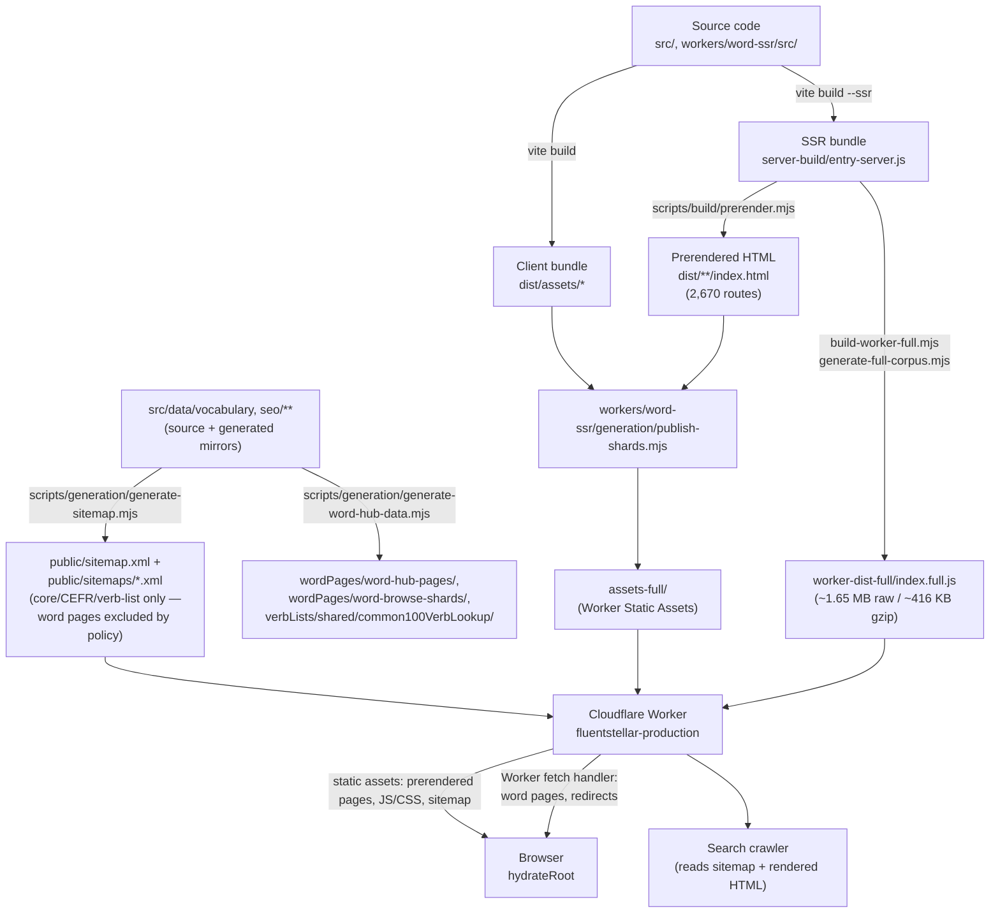

# FluentStellar Architecture

This is the orientation document for the repository — it explains how the
pieces fit together and links to the specialized ownership docs for detail.
It does not duplicate their content.

Structural claims (rendering paths, ownership boundaries, guard behavior)
are kept current by `test:architecture-documentation` and the other
architecture guards below. Specific counts (prerendered routes, sitemap
URLs, Worker bundle size) are point-in-time measurements, not permanent
invariants — each is labeled inline as a measured baseline; re-verify them
from the commands cited next to each figure rather than trusting the number
itself to stay accurate.

## System overview

FluentStellar is a React 18 + Vite + TypeScript single-page app with two
complementary rendering strategies layered on top of it:

1. **Build-time prerendering (SSG)** — `npm run build` renders a fixed set
   of routes (home, language/level/category/exercise selection, practice,
   about/help, the CEFR vocabulary-level pages, SEO hub pages, level-test
   SEO pages, verb-list pages) to static `index.html` files under `dist/`.
   These ship as Cloudflare Static Assets and are served with no server
   code running.
2. **Runtime SSR in a Cloudflare Worker** — the much larger set of
   individual word pages (one per vocabulary word × UI language) is too
   large to prerender (see [Prerendering vs. sitemap](#prerendering-vs-sitemap)
   below) and is rendered on request by `workers/word-ssr/`, using the same
   `src/entry-server.tsx` `render()` function the prerender script uses.

Both paths produce complete server-rendered HTML (not a bare `<div id="root">`
shell); the browser then hydrates onto whichever one it received. There is
no client-only-rendered indexable route.

Vercel and GitHub Pages were both retired; Cloudflare is the sole production
platform. See [`docs/deployment.md`](deployment.md) for the authoritative,
continuously-reverified deployment/runtime record — this document explains
architecture and ownership, that one explains current production behavior
and status.

## Request and rendering paths

- **Static assets** (`/assets/*.js`, `/assets/*.css`, images, fonts,
  `robots.txt`, `sitemap.xml`) — served directly by Cloudflare Workers
  Static Assets. The Worker's `fetch` handler never runs for these; asset
  lookup happens before Worker invocation.
- **Prerendered routes** — also served directly as static assets (the
  prerendered `index.html` files live in the same assets directory as the
  JS/CSS). No Worker code runs for these either.
- **Worker-rendered word routes** — canonical word pages, word browse
  pagination pages, legacy/alias word URL redirects, and the browse-shard
  JSON endpoint have no matching static file, so Cloudflare falls through to
  `workers/word-ssr/src/index.full.ts`'s `fetch` handler, which performs a
  concept-shard lookup and SSRs the page with `render-entry.tsx`. See
  [`workers/word-ssr/docs/route-ownership.md`](../workers/word-ssr/docs/route-ownership.md)
  for the exact route split, verified against a running `wrangler dev`
  instance.
- **Browser hydration** — `src/entry-client.tsx` checks whether the root
  element already has server-rendered markup. If so it `hydrateRoot`s
  (prerendered pages and Worker-rendered pages both qualify); otherwise it
  falls back to a plain client render (local `npm run dev`, where
  `src/main.tsx` is the entry instead).



## Repository ownership map

| Area | Authoritative source | Generated output | Guard/test |
|---|---|---|---|
| React application | `src/app/`, `src/contexts/`, `src/features/`, `src/lib/` | `dist/`, `server-build/` (gitignored) | `npx tsc --noEmit`, `npm run build` |
| Routes | `src/app/App.tsx` (`ROUTES`), `src/app/utils/pageRouting.ts` (`PageKey`, parsers), `src/data/seo/*Slugs.ts`, `vocabularyLevels/vocabularyLevelRoutes.ts`/`shared/hub.ts` | `getPrerenderRoutes()` output (prerendered set) | `test:interactive-contracts`, `test:word-seo` |
| SEO metadata | `src/seo/routeMetadataPolicy.ts`, `src/seo/site.ts`, `src/seo/SeoContext.tsx`, `src/data/seo/wordPages/wordPageData.ts`, `src/seo/metadata.ts` (compatibility facade re-exporting `src/seo/hubPages/hubMetadata.ts`, `src/seo/levelTests/levelTestMetadata.ts`, `src/seo/verbLists/common100Verbs/common100VerbsMetadata.ts`, `src/seo/wordPages/wordMetadata.ts`, `src/seo/vocabularyLevels/{seoFaq,seoSchema,seoTemplates}.ts` — `hubTemplates.ts`, `wordTemplates.ts`, and `shared/seoAlternates.ts` are lower-level helpers those modules import internally, not re-exported by the facade itself) | rendered `<head>` tags (prerendered + Worker HTML) | `test:seo-output` (chained suite) |
| Prerendered pages | `src/entry-server.tsx` (`render`, `getPrerenderRoutes`) | `dist/**/index.html` (2,670 files) | `test:prerender-parity` |
| Sitemap | `scripts/generation/generate-sitemap.mjs` + vocabulary/route data | `public/sitemap.xml`, `public/sitemaps/*.xml` (core/CEFR/verb-list families; word pages intentionally excluded — see "Prerendering vs. sitemap") | `test:sitemap-structure`, `test:sitemap-vocabulary-route-source`, `test:sitemap-lastmod` |
| Word Worker | `workers/word-ssr/src/` | `worker-dist-full/`, `assets-full/`, `data/full-corpus/` (all gitignored) | `test:word-worker:production-safety` |
| Vocabulary data | `src/data/vocabulary/`, `src/data/seo/vocabularyLevels/` (incl. `level-browse-preview/`, `seo-cefr-content.json`), `src/data/seo/levelTests/` | `src/data/seo/wordPages/word-hub-pages/`, `wordPages/word-browse-shards/`, `verbLists/shared/common100VerbLookup/` | [`docs/generated-data.md`](generated-data.md), `test:generated-data-ownership` |
| UI components | `src/app/components/ui/` (9 retained files: 8 UI primitives/wrappers plus the shared `cn()` class-name utility, `utils.ts`) | none | [`docs/ui-component-ownership.md`](ui-component-ownership.md), `test:ui-component-ownership` |
| Dependencies | `package.json` (33 direct entries: 23 `dependencies`, 10 `devDependencies`) | none | [`docs/dependency-ownership.md`](dependency-ownership.md), `test:dependency-ownership` |
| AI-assistant guidance | `guidelines/Guidelines.md` (Markdown-only) | none | `test:guidelines-ownership` |
| Brand assets | `src/assets/brand/favicon-master.png` (not shipped) | `public/favicon.png`, `favicon.ico`, `apple-touch-icon.png`, `og-image.png` | [`docs/brand-asset-ownership.md`](brand-asset-ownership.md), `test:brand-asset-ownership` |
| Operational scripts | `scripts/operations/` | `scripts/operations/state/indexed-progress.json` (gitignored) | [`docs/google-indexing-operations.md`](google-indexing-operations.md), `test:operational-security` |
| Local agent state | n/a (tool-created) | `.agents/`, `.claude/`, `.codex/` (gitignored, untracked) | `test:agent-folder-ownership` (see "Local-only state" below) |

Within `src/app/`, page ownership is split by directory: `src/app/pages/`
owns route-level application pages (rendered directly from a route branch
in `App.tsx`); `src/app/components/` owns reusable, shared, and app-shell
components (layout, dialogs, UI primitives) consumed by more than one page
or by the app shell itself. This split is being introduced in phases as
part of an ongoing `src/app/components/` cleanup — so far `About.tsx`,
`Help.tsx`, `ExplorePage.tsx`, and `VocabularyLevelExam.tsx` have moved to
`src/app/pages/`, and the profile route/shell has moved to
`src/features/user-profile/` (`sections/UserProfileDashboardPage.tsx`,
`sections/dashboard/DashboardSection.tsx`, `sections/learning/LearningSection.tsx`,
`components/UserProfileSidebar.tsx`, `styles/user-profile-sidebar.scss`,
public entry point `index.ts`). Global authentication/session infrastructure
(`src/lib/supabaseAuth.ts`, `src/lib/userProfile.ts`) and shared
account/onboarding behavior (`src/app/hooks/useAccountOnboarding.ts`,
`useAccountLanguageConfirm.ts`, `useUserProfileLoad.ts`, the
`AccountOnboardingDialog`/`AccountLanguageConfirmDialog` components) remain
outside the feature — they are consumed by more than just the profile page.
`user_profiles.timezone` stores an optional IANA timezone for authenticated
users. The browser detects it with
`Intl.DateTimeFormat().resolvedOptions().timeZone` after profile load and
silently initializes it through `initialize_user_timezone(text)` only when
the stored value is null; PostgreSQL validates the value against
`pg_catalog.pg_timezone_names`. Manual timezone correction belongs to a
future Settings page. Learning RPCs no longer accept client-provided
`p_stat_date` at all — the temporary compatibility wrappers were dropped
once the server-derived frontend build became the only caller; an older
build that still sends `p_stat_date` now fails outright with `PGRST202`
instead of being silently accepted. Daily-stat attribution uses Supabase
server time plus `user_profiles.timezone`, falling back to UTC when the
profile row/timezone is missing, blank, or invalid. Historical
`user_daily_stats` rows are not rewritten, and manual timezone correction
still belongs to a future Settings page. On the Learning dashboard,
`LearningSection.tsx` is the single frontend owner of the
`get_current_learning_date()` call for the mounted dashboard — it fetches
once and passes the result down to `TodayProgressCard` and
`DailyStreakCard` as `todayISO`/`todayISOStatus` props, so a failed fetch
is distinguishable from a legitimate no-session state; neither card calls
it directly (see
[`src/features/user-profile/sections/learning/README.md`](../src/features/user-profile/sections/learning/README.md)'s
"Server-derived learning dates" section).
`src/app/components/layout/` owns shared application layout/navigation
components — the global header, its UI-language switcher, and the
scroll-to-top control (`Header.tsx`, `UILanguageSwitcher.tsx`,
`ScrollToTopButton.tsx`) — reusable shell UI consumed across routes, as
distinct from pages, feature-owned components, SEO page renderers, dialogs,
and the `ui/` primitive library. `src/app/pages/home/` owns the homepage
route and homepage-specific components — `HomePage.tsx` plus its two
homepage-exclusive subcomponents, `FloatingWords.tsx` (decorative animation)
and `LanguageContinuePopup.tsx` (the "select languages" nudge). Components
still shared across pages (`LanguageSelector.tsx`, used by the homepage,
account onboarding, and the level-test language modal) remain outside this
folder in `src/app/components/`. `src/app/components/dialogs/` owns shared
application/account dialogs — `AccountOnboardingDialog.tsx` and
`AccountLanguageConfirmDialog.tsx`, both rendered from the app shell across
multiple routes. `src/app/pages/level-test/` owns the complete Level Test
page family: `LevelTestSeoPage.tsx` (the route) and
`LevelTestLanguageModal.tsx` (its page-specific language-selection modal,
rendered only alongside this page). Despite its modal implementation,
`LevelTestLanguageModal.tsx` is not part of the shared dialog system in
`src/app/components/dialogs/` and is not globally reusable — it stays
beside the page that owns it. `NotFoundPage.tsx` (the shared 404 fallback, rendered from several
route branches in `App.tsx`) and `SeoHubPage.tsx` (the SEO page index) have
moved to `src/app/pages/` alongside the Phase 1 pages above — both are
standalone route-level pages with a single `App.tsx` consumer and no
membership in a larger page family. `src/app/pages/verb-lists/` owns
verb-list route pages as a general category, split into per-subtype folders
mirroring `src/data/seo/verbLists/` and `src/seo/verbLists/`; `common100Verbs/`
holds `VerbListSeoPage.tsx` (route entry), `RichVerbListSeoPage.tsx`
(rich-content view), and `VerbListSeoTableOnlyPage.tsx` (fallback view,
runtime-coupled to common100Verbs fallback copy). `pastForms100Verbs/` is a
sibling subtype (`PastVerbFormsSeoPage.tsx` + `PastVerbFormsTableSection.tsx`)
for the "Past Forms of the 100 Most Common {Target Language} Verbs" family.
Its registry and metadata builder own that subtype's routing and SEO policy;
the `PAST_VERB_FORMS_LAUNCHED` flag (`src/seo/verbLists/pastForms100Verbs/pastVerbFormsLaunchStatus.ts`)
keeps the current 49 authored canonical pages indexable and included in
`verb-lists.xml`. Future verb-list families (e.g. irregular, modal, or
separable verbs) would live as further sibling subtype folders under
`verb-lists/`; shared extraction across subtypes should happen only once a
subtype genuinely reuses another's implementation, not preemptively.
`src/app/pages/vocabulary/` owns the Vocabulary Level/CEFR page family:
`VocabularyLevelPage.tsx` (the production vocabulary-level rendering flow),
`DevSeoCefrPlaceholderPage.tsx`, and `devSeoCefrPreviewData.ts`. Despite their
"dev"/"preview" naming, the latter two are production-runtime code — every
`vocabularyLevel` route's visible body renders through
`DevSeoCefrPlaceholderPage`, backed by `devSeoCefrPreviewData.ts`'s
full-coverage content lookup (see `docs/generated-data.md`); this legacy
naming was preserved as-is, not treated as dev-only.
`src/app/pages/word-pages/detail/` owns individual word-detail-page
rendering — `WordSeoPage.tsx` (the client/production data-acquisition
wrapper), `WordSeoPageView.tsx` (the SSR-safe presentational core), and
`WordPageLayout.tsx` (the word-detail-page shell) — and supports both the
normal application rendering path and Word Worker rendering. `WordPageLayout`
is not general-purpose application layout despite its name; it is scoped
to this page family and, together with `WordSeoPageView`, is imported
directly by `workers/word-ssr/src/render-entry.tsx`. The Worker must never
import `WordSeoPage` — only `WordSeoPageView` and `WordPageLayout` are direct
Worker rendering dependencies; see `docs/import-boundaries.md` (G7) for the
historical bundle-bloat incident this boundary prevents from recurring.
`src/app/pages/word-pages/hub/` owns the word-hub/index routes
(`WordSeoHubPage.tsx`) — a separate sibling page family with its own route
parser, `App.tsx` branch, and metadata ownership; it is prerendered
separately and is not part of the Word Worker rendering path.

Distinguishing source vs. output:

- **Source files** — hand-maintained, committed, edited directly:
  `src/app/`, `src/data/vocabulary/`, `src/data/seo/vocabularyLevels/`
  (incl. `level-browse-preview/`, `seo-cefr-content.json`),
  `src/data/seo/levelTests/*.json`, `workers/word-ssr/src/`, `scripts/`.
- **Generated, committed files** — never hand-edited, regenerated by a
  script: `src/data/seo/wordPages/word-hub-pages/`, `wordPages/word-browse-shards/`,
  `src/data/seo/verbLists/shared/common100VerbLookup/`, `public/sitemap.xml` + `public/sitemaps/`.
- **Ignored build output** — regenerated by `npm run build`, never
  committed: `dist/`, `server-build/`.
- **Ignored Worker build output** — regenerated by
  `npm run build:word-worker:full` (Cloudflare's remote build):
  `workers/word-ssr/worker-dist-full/`, `assets-full/`, `data/full-corpus/`.
- **Local-only state** — created by AI coding-assistant tools running
  against this repo, never tracked: `.agents/`, `.claude/`, `.codex/`.

Full detail lives in [`docs/generated-data.md`](generated-data.md) (data
ownership) and [`docs/import-boundaries.md`](import-boundaries.md) (the
`import.meta.glob` boundaries that make several of these directories
path-sensitive).

## Routing

`src/app/App.tsx` defines a small `ROUTES` map (`language`, `levelCategory`,
`exerciseSelection`, `practice`, `explore`, `exam`, `about`, `help`,
`profile`); `src/app/utils/pageRouting.ts` defines the wider `PageKey` union
that also covers SEO-driven route families resolved by pattern-matching
helpers in `src/data/seo/`:

- `vocabularyLevel` — CEFR level pages (`resolveVocabularyRoute`)
- `levelTestSeo` — per-language level-test SEO pages
- `verbListSeo` — "100 most common verbs" pages
- `seoHub` / `wordSeoHub` — SEO hub/index pages
- `wordPage` — canonical word pages (Worker-rendered only)
- `devSeoCefrPlaceholder` — dev-only preview route, `import.meta.env.DEV`-gated
- `notFound`

`pageFromPath()` in `src/app/utils/pageRouting.ts` resolves a pathname to a
`PageKey` using the same route parsers on both the client and in
`src/entry-server.tsx`, so client routing, prerendering, and Worker SSR
agree on what a given URL means.

## SEO rendering

- **Static-route metadata** (`title`, `description`, `canonical`, `robots`)
  — `src/seo/routeMetadataPolicy.ts`, keyed by pathname classification
  (`homepage`, `public-seo`, `private-account`, `practice-session`,
  `public-app`, `invalid`).
- **Word-page metadata** — `src/data/seo/wordPages/wordPageData.ts`, built from the
  matched concept record.
- **Rendering** — `src/seo/SeoContext.tsx`'s `renderSeoTags()` emits the
  `<title>`, meta description, canonical link, hreflang alternates, robots
  directive, Open Graph tags, and JSON-LD structured data into the HTML
  `<head>` for both prerendered and Worker-rendered pages, from the same
  code path (`src/entry-server.tsx`'s `render()`).
- **Default/site-wide values** — `src/seo/site.ts` (canonical origin,
  default OG image, homepage fallback metadata).
- **Sitemap entries** — `scripts/generation/generate-sitemap.mjs`, reading vocabulary,
  level-test, and verb-list route data directly (not the rendered HTML).

Guard/test scripts (actual `package.json` names): `test:word-ssr-http`,
`test:word-ssr-package`, `test:homepage-visibility`, `test:jsonld-escaping`,
`test:schema-graph`, `test:word-browse-pagination`, `test:prerender-parity`,
`test:sitemap-structure`,
`test:sitemap-vocabulary-route-source` (verifies `sitemap-cefr.xml`
vocabulary-level routes against `getAllLocalizedVocabularyRoutes()`),
`test:sitemap-lastmod`, `test:seo-core-routes`, `test:html-lang-init` —
chained together as `npm run test:seo-output`.
Consistency between client rendering, prerender output, and Worker SSR
output is additionally checked by the SEO/performance baseline capture-and-compare
pair documented in [`scripts/README.md`](../scripts/README.md)
(`npm run seo-baseline:capture` / `seo-baseline:compare`).

## Prerendering vs. sitemap

**Prerendered pages: 2,670.** Sitemap coverage is narrower by design, not a
discrepancy:

- `src/entry-server.tsx`'s `getPrerenderRoutes()` returns the core app
  routes, all UI-language × practice-language practice-route combinations,
  every CEFR vocabulary-level page, every SEO hub page, every word-hub page,
  every level-test SEO page, and every verb-list page — **2,670 routes
  total**, each written to a physical `dist/**/index.html` file by
  `scripts/build/prerender.mjs`. A `WORD_PRERENDER_LIMIT` env var exists to
  optionally prerender a subset of individual word pages too, but it
  defaults to `0`, so a plain `npm run build` prerenders **zero** individual
  word pages — confirmed by reading `collectWordRoutesSubset()`'s
  early-return on a non-positive limit.
- `scripts/generation/generate-sitemap.mjs` runs during `npm run build`'s
  `prebuild` step and writes `public/sitemap.xml` plus three child sitemaps —
  `sitemap-core.xml`, `sitemap-cefr.xml` (CEFR vocabulary-level + level-test
  routes), and `verb-lists.xml`. Individual word pages are intentionally
  **excluded** from sitemap discovery: the generator's `INCLUDE_WORD_SITEMAPS`
  policy gate defaults to `false` (2026-07-24 sitemap-policy reconciliation),
  to focus sitemap discovery on the core/CEFR/verb-list families. This is a
  sitemap-*discovery* decision only — word pages remain fully live, routable,
  and indexable under their own metadata policy
  (`src/seo/wordPages/wordMetadata.ts`); they simply aren't submitted via XML
  sitemap. Being a source-level default rather than a one-off file deletion,
  the exclusion holds across `npm run sitemap`, `npm run build`, CI, and
  Cloudflare's remote build alike. The generated XML under `public/` is
  tracked and must stay synchronized with the generator — drift is caught by
  `npm run test:sitemap-structure`.
- Word pages remain resolvable at request time through `workers/word-ssr/`'s
  Worker `fetch` handler, which calls the same `render()` function
  `scripts/build/prerender.mjs` uses, so the Worker returns complete
  server-rendered HTML — full markup with SEO tags already present, not a
  client-only shell that would need JavaScript to become indexable. React
  then hydrates onto that markup in the browser exactly as it does for a
  prerendered page.
- Both prerendered HTML and Worker-rendered HTML are SEO-valid because they
  go through the identical `render()`/`renderSeoTags()` code path — the
  only difference is *when* rendering happens (build time vs. request
  time), not *what* is produced.

This is verifiable from code (`entry-server.tsx`, `scripts/build/prerender.mjs`,
`generate-sitemap.mjs`, `route-ownership.md`) and from a local `dist/` +
`public/sitemaps/` tree after `npm run sitemap`; it has not been confirmed
against a live production crawl.

## Data generation

Canonical vocabulary and SEO content sources, their generated mirrors, and
the scripts that keep them in sync are fully documented in
[`docs/generated-data.md`](generated-data.md) — the ownership matrix there
is the authoritative reference; this section only orients:

- Hand-maintained sources (no generator; edit directly): `src/data/vocabulary/`,
  `src/data/seo/vocabularyLevels/` (incl. `level-browse-preview/`,
  `seo-cefr-content.json`), `src/data/seo/levelTests/seo_level_test_content.json`,
  `src/data/seo/verbLists/pastForms100Verbs/pastForms100VerbsContent.json`
  (Phase 1 foundation for the "Past Forms of the 100 Most Common
  {Target Language} Verbs" family — every field is an empty placeholder
  until a later phase authors real content; see
  [`docs/generated-data.md`](generated-data.md)).
- Generated, committed mirrors/output (never hand-edited):
  `src/data/seo/wordPages/word-hub-pages/`, `wordPages/word-browse-shards/`,
  `src/data/seo/verbLists/shared/common100VerbLookup/` (via `npm run generate:word-hub-data`);
  `public/sitemap.xml`/`public/sitemaps/` (via `npm run sitemap`, which
  enumerates CEFR vocabulary-level routes from `getAllLocalizedVocabularyRoutes()`).
- After editing a hand-maintained source, run its regeneration/sync command
  (see the table in `docs/generated-data.md`) and `npm run test:generated-data-ownership`.
- `import.meta.glob` boundaries that make several of these directories
  path-sensitive to moves are separately guarded — see
  [`docs/import-boundaries.md`](import-boundaries.md).

## Worker architecture

`workers/word-ssr/` is the production Cloudflare Worker. Full detail —
route split, build/packaging commands, bundle-size limits, and production
safety checks — lives in [`docs/deployment.md`](deployment.md) and
[`workers/word-ssr/docs/route-ownership.md`](../workers/word-ssr/docs/route-ownership.md).
For which file belongs in which subfolder of `workers/word-ssr/` (ownership
and placement rules for new or moved files), see
[`workers/word-ssr/README.md`](../workers/word-ssr/README.md) — this section
stays a high-level orientation and does not repeat that guide's detail.
Orientation:

- **Purpose**: SSR word pages, word-browse pagination, legacy-URL redirects,
  and the browse-shard JSON endpoint — the routes too numerous to prerender.
- **Source**: `workers/word-ssr/src/index.full.ts` (production entry),
  `render-entry.tsx` (SSR), `shard-store.ts` (concept-shard lookup). This is
  the only Worker pipeline — the earlier 81-word sample (`src/index.ts` +
  `wrangler.toml`) was removed after Phase 9 of the `workers/word-ssr/`
  cleanup confirmed it had no production dependency.
- **Generated payload**: `generate-full-corpus.mjs` builds the data corpus
  and mints a UTC-dated `dataVersion`; `publish-shards.mjs` assembles
  `assets-full/` from `dist/**` plus the corpus; `scripts/build/build-word-worker-full.mjs`
  bundles `worker-dist-full/index.full.js` via `vite.worker.config.mjs`.
  All three output directories are gitignored — Cloudflare's remote build
  regenerates them on every deploy, not a developer's machine.
- **Commands**: `npm run build:word-worker:full` (full rebuild + corpus +
  packaging). Manual deploy fallback:
  `npx wrangler deploy --config workers/word-ssr/config/wrangler.production.toml`.
- **Cloudflare limits (Free plan)**: 3 MB gzip hard limit; this repo
  enforces an internal 2.5 MB gzip budget (`test:word-worker:bundle-size`).
  Static Assets cap at 20,000 files/version, which is why the ~85k-URL word
  corpus stays SSR instead of being prerendered.
- **Measured baseline (not a permanent guarantee unless a guard enforces
  it)**: 1 Worker output file, ~1.65 MB raw
  (currently-built `worker-dist-full/index.full.js` measured at 1,654,459
  bytes), ~416 KB gzip (measured 425,969 bytes via `gzip -9` against that
  same file). The enforced ceiling is the 2.5 MB internal budget, not these
  point-in-time numbers.
- **Never hand-edit** `worker-dist-full/`, `assets-full/`, or
  `data/full-corpus/` — they are fully regenerated by the commands above.

## Build and deployment

Local build (`npm run build`):

1. `prebuild` — `generate:word-hub-data` → `sitemap`.
2. `vite build` → client bundle in `dist/`.
3. `vite build --ssr src/entry-server.tsx --outDir server-build` → SSR
   bundle.
4. `scripts/build/copy-ssr-template.mjs` — copies `dist/index.html` →
   `server-build/ssr-template.html`, preparing the frontend HTML as the
   SSR template consumed by the server/Worker packaging flow.
5. `scripts/build/prerender.mjs` — SSGs all 2,670 routes into `dist/`.
6. `scripts/build/verify-word-ssr-package.mjs` — smoke-tests the Node SSR runtime.

Cloudflare deployment: pushes to `master` trigger Cloudflare Workers Builds
(Git integration), which runs `npm run build && npm run build:word-worker:full`
then Wrangler deploys automatically. This configuration lives only in the
Cloudflare dashboard, not in this repository. See
[`docs/deployment.md`](deployment.md) for the full, continuously-reverified
record, including domain/redirect/WAF behavior.

Separately, `.github/workflows/ci.yml` runs a lightweight GitHub Actions
regression gate on every pull request and push to `master`: `test:feature-contracts`,
then `npx tsc --noEmit`, `test:architecture-guards`, a production build with a
tracked-file-drift check, and finally `test:seo-output`. This is a PR/push
gate only — it is independent of and does not perform the Cloudflare
deployment described above.

## Architecture guards

`npm run test:architecture-guards` chains **26 guard groups**, each a
deterministic, network-free Node script asserting one repository contract:

| Guard | Script | Protects |
|---|---|---|
| `test:word-seo` | `scripts/tests/seo/test-word-seo-routes.mjs` | word-route SEO source contracts |
| `test:level-browse-preview` | `scripts/tests/routing/test-level-browse-preview-completeness.mjs` | 42-key CEFR preview match set |
| `test:word-route-manifest` | `scripts/tests/routing/test-word-route-manifest.mjs` | canonical/legacy word-route parsing and building (round-trip contract across all 7 target languages) |
| `test:word-hydration` | `scripts/tests/runtime/test-word-hydration.mjs` | word-page hydration payload shape/size and lazy-loaded browse-search-data wiring |
| `test:import-boundaries` | `scripts/tests/architecture/test-import-boundaries.mjs` | `import.meta.glob` match counts/eager-lazy (G1–G9) |
| `test:generated-data-ownership` | `scripts/tests/architecture/test-generated-data-ownership.mjs` | generated/mirrored data directories |
| `test:vocabulary-level-coverage` | `scripts/tests/architecture/test-vocabulary-level-content-coverage.mjs` | `seo-cefr-content.json` exactly covers every registered vocabulary-level route (no missing/duplicate/unexpected combination) |
| `test:interactive-contracts` | `scripts/tests/routing/test-interactive-contracts.mjs` | route strings, profile-shell wiring, localStorage keys |
| `test:ui-component-ownership` | `scripts/tests/architecture/test-ui-component-ownership.mjs` | `src/app/components/ui/` reachability |
| `test:dependency-ownership` | `scripts/tests/architecture/test-dependency-ownership.mjs` | `package.json` direct-dependency usage |
| `test:legacy-poc-ownership` | `scripts/tests/architecture/test-legacy-poc-ownership.mjs` | removed `poc/cloudflare-word-renderer/` stays removed |
| `test:guidelines-ownership` | `scripts/tests/architecture/test-guidelines-ownership.mjs` | `guidelines/` stays Markdown-only |
| `test:operational-security` | `scripts/tests/architecture/test-operational-security.mjs` | credential handling, legacy script paths |
| `test:agent-folder-ownership` | `scripts/tests/architecture/test-agent-folder-ownership.mjs` | `.agents/`/`.claude/`/`.codex/` stay untracked |
| `test:brand-asset-ownership` | `scripts/tests/architecture/test-brand-asset-ownership.mjs` | favicon/OG-image master and variants |
| `test:architecture-documentation` | `scripts/tests/architecture/test-architecture-documentation.mjs` | this document's paths/links/scripts stay wired to reality |
| `test:protected-learning-writes-boundary` | `scripts/tests/architecture/test-protected-learning-writes-boundary.mjs` | `authenticated` only reaches `user_word_progress`/`user_daily_stats` via SELECT or the learning RPCs, never a direct write |
| `test:learning-non-negative-values-contract` | `scripts/tests/architecture/test-learning-non-negative-values-contract.mjs` | no application code assigns a negative value/sentinel to `correct_streak` or the daily-stats counters (see corrective migration 2's non-negative `CHECK` constraints in `supabase/README.md`) |
| `test:learning-profile-data-flow` | `scripts/tests/architecture/test-learning-profile-data-flow.mjs` | the Learning dashboard loads the signed-in user's profile exactly once (App.tsx) and threads it down as props, instead of Daily Goal/Daily Streak/Today's Progress each fetching their own copy |
| `test:learning-section-date-ownership` | `scripts/tests/architecture/test-learning-section-date-ownership.mjs` | Profile-section data optimization Phase 1: `useProfileSharedProgressData` (called once from `UserProfileDashboardPage`) is the whole `/profile` dashboard's single frontend owner of `getCurrentLearningDate()`, threading `todayISO`/`todayISOStatus` down through `LearningSection` to `TodayProgressCard`/`DailyStreakCard` as props instead of any section calling the RPC itself; a date `"error"` blocks both cards' own requests and never presents a zero/empty result as successfully-loaded data, and neither a practice-language change nor a daily-goal save triggers a second date request |
| `test:vocabulary-profile-data-flow` | `scripts/tests/architecture/test-vocabulary-profile-data-flow.mjs` | the Vocabulary dashboard section reuses the Learning dashboard's single App.tsx profile load instead of fetching its own copy on every mount, and (Phase 1) resolves the shared active-language `user_word_progress` rows passed in from `useProfileSharedProgressData` instead of fetching its own copy via `readUserWordProgress` |
| `test:supabase-error-handling` | `scripts/tests/architecture/test-supabase-error-handling.mjs` | Study New Words/Review Words/favorite/profile-save all classify Supabase/PostgREST failures through the shared `src/lib/supabaseError.ts` module instead of duplicated message-regex checks, and never render raw Supabase error text |
| `test:password-recovery-completion` | `scripts/tests/architecture/test-password-recovery-completion.mjs` | `handleSupabaseAuthRedirect` distinguishes a password-recovery redirect from an ordinary login/OAuth one and cleans up its URL params, `updateSupabaseAuthUserPassword` updates only the access-token-authenticated user (never a caller-supplied ID), AppContent is the sole redirect-handling owner (Header no longer runs its own copy), and the Set-new-password dialog validates, guards duplicate submission, and preserves recovery/session state on failure |
| `test:timezone-profile-boundary` | `scripts/tests/architecture/test-timezone-profile-boundary.mjs` | timezone writes stay isolated to `initialize_user_timezone`, neither narrow profile RPC (`complete_user_profile_onboarding`, `update_user_profile_languages`) can modify timezone, no Settings UI is introduced yet, and authoritative learning reads/writes use the server-derived learning date |
| `test:daily-goal-narrow-write-boundary` | `scripts/tests/architecture/test-daily-goal-narrow-write-boundary.mjs` | Streak Phase 1: `DailyGoalSelector` saves only through the narrow `update_daily_goal` RPC (no other file calls it), onboarding/language-confirm use their own narrow RPCs (Profile Phase 1) rather than the removed broad upsert, the streak read path selects each row's own `daily_goal` snapshot, the snapshot migration never bulk-rewrites existing rows, and (Streak Phase 1 corrective fix) the pure streak model resolves each row's own goal or a fixed `LEGACY_DAILY_GOAL` constant — never the live current profile goal, which `computeDailyStreakSummary` no longer even accepts as a parameter — and `DailyStreakCard` never receives or forwards a `dailyGoal` prop |
| `test:user-profiles-narrow-write-boundary` | `scripts/tests/architecture/test-user-profiles-narrow-write-boundary.mjs` | Profile Phase 1: no frontend file constructs a direct `user_profiles` table mutation or references the removed `writeSupabaseUserProfile`, onboarding calls only `completeUserProfileOnboarding` and language-confirm calls only `updateUserProfileLanguages`, neither RPC's request body can include `daily_goal`/timezone fields, and both RPC response parsers reject malformed rows |
| `test:vocabulary-growth-section-rendering` | `scripts/tests/architecture/test-vocabulary-growth-section-rendering.mjs` | Vocabulary Growth is actually wired into the Progress page's real render tree below Milestones (not just an unused component), its 7/30/90/all range controls exist and switch data locally without refetching, and no Supabase write verb appears anywhere in the section/chart components |
| `test:daily-stats-shared-ownership` | `scripts/tests/architecture/test-daily-stats-shared-ownership.mjs` | Fetch-audit Phase 1: `useProfileSharedDailyStats` is the single, lazily-loaded owner of the unbounded `user_daily_stats` rows and vocabulary-growth `review_events` for the whole `/profile` dashboard — Dashboard/Learning/Progress each request only the resource(s) they need once per mount instead of fetching their own copy, Vocabulary/My Lists/Settings never reference either resource at all, the cache key is `(authUserId, targetLanguage)` only (never `todayISO`/timezone), a previously-failed context retries on the next mount, and every write that changes `user_daily_stats`/`review_events` fires the correct narrow `notifyDailyStatsChanged`/`notifyVocabularyGrowthChanged` signal(s) |
| `test:learning-date-in-flight-dedup` | `scripts/tests/architecture/test-learning-date-in-flight-dedup.mjs` | Fetch-audit Phase 2A: `useProfileSharedProgressData`'s learning-date effect (unlike the lazily-gated daily-stats hook, it fetches unconditionally on every run) issues exactly one `get_current_learning_date` RPC per fresh `authUserId` context via an `inFlightDateKeyRef` guard, keyed on `authUserId` alone (the RPC takes no client timezone parameter); a settling attempt's result is applied by comparing that ref rather than a per-effect-invocation `cancelled` closure, so an intermediate `isProfileLoaded`-false render mid-load can never discard an in-flight response or leave the date stuck loading; a genuine account change hard-resets the marker while a same-user profile-reload window deliberately leaves it alone; the word-progress effect in the same file stays untouched |

SEO/Worker-specific guards (`test:seo-output`,
`test:word-worker:production-safety`) are chained separately, not part of
`test:architecture-guards` — see [Validation commands](#validation-commands).

## Learning statistics

Study New Words, Review Words, and Custom Practice each track their own
active-time column on `user_daily_stats` (`new_word_study_time_seconds`,
`review_time_seconds`, `custom_practice_time_seconds`) via a shared timer
utility (`src/data/learning/activeWordTimer.ts`, which also debounces idle
time via `recordInteraction()`/`idleThresholdMs`). `study_time_seconds`
itself is the server-maintained per-day **total** across all three modes
(Study Activity Phase 1, `supabase/migrations/
20260811120000_add_new_word_study_time_and_repurpose_total.sql`) — every
completion RPC increments its own mode column and this total atomically, in
the same upsert, so no client ever computes or sends a total. The read side
(`src/lib/learningTimeStats.ts`) still re-derives `totalTimeSeconds` from
the three mode columns rather than trusting `study_time_seconds` as a
passthrough, for the same "never trust a stored total" reason the module
has always followed. The Dashboard's "Study Activity" card
(`src/features/user-profile/sections/dashboard/StudyActivityCard.tsx`) is
this data's first UI consumer — a stacked per-day time chart, not the
quantity chart it replaced. The temporary duration-aware/legacy RPC
signatures introduced during the original staged rollout have since been
dropped (see `test:drop-legacy-learning-rpc-signatures-migration-contract`)
— there is no follow-up cleanup migration still pending. Full design
(word-level timing, the 300-second cap, per-mode idempotency) is documented
in
[`src/features/user-profile/sections/learning/README.md`](../src/features/user-profile/sections/learning/README.md)
and `supabase/README.md`'s Corrective Migration 5 / Study Activity Phase 1
sections — not duplicated
here.

## Operations

Operational scripts live under `scripts/operations/`. The only current one
is Google Search Console indexing (`npm run google:index`), manual-only,
never wired into `prebuild`/`build`/CI/deploy. Credentials resolve from
`GOOGLE_APPLICATION_CREDENTIALS` or a gitignored `service-account.json`;
progress state is a gitignored JSON file at
`scripts/operations/state/indexed-progress.json`. `--dry-run` validates
without making API calls or writing state. Full detail, including
credential-rotation steps: [`docs/google-indexing-operations.md`](google-indexing-operations.md).

## Local-only state

`.agents/`, `.claude/`, and `.codex/` may reappear on disk at any time —
they are created by AI coding-assistant tools (Claude Code, Codex-style
CLIs) as per-machine session state (locks, scheduled-task metadata, caches),
not project source. Git does not track empty directories, so a folder can
exist on disk with zero effect on `git status` — that is expected, not a
sign of repository drift. All three are wholesale-ignored in the tracked
`.gitignore`. Canonical, shared instructions for AI assistants live in
exactly one place: `AGENTS.md` at the repository root. Never commit a file
from inside one of these folders; if a tool ever writes project instructions
there, move the content into `AGENTS.md` instead. To inspect these folders
safely:

```bash
git ls-files .agents .claude .codex   # should always print nothing
git check-ignore -v .claude/<file>    # confirms a given file is ignored
```

`guidelines/` is a separate, tracked directory and is **not** local-only
state — it is human-guidance-only (currently just `guidelines/Guidelines.md`),
never application, SEO, or build data. Only Markdown belongs there; new
application or SEO data goes under `src/data/` next to its consumer instead.
Enforced by `test:guidelines-ownership`.

## Brand assets

Master artwork (`src/assets/brand/favicon-master.png`, not shipped) is
downsampled by `python scripts/generation/generate-brand-assets.py` into
`public/favicon.png`, `favicon.ico`, `apple-touch-icon.png`, and
`og-image.png`. Never hand-edit the generated `public/` copies or their
`dist/`/`server-build/`/`assets-full/` build-output copies. Full asset
table, size budgets, and regeneration steps:
[`docs/brand-asset-ownership.md`](brand-asset-ownership.md).

## Documentation map

Every retained document under `docs/` (plus two that live next to what they
describe) has a distinct, non-overlapping scope. This document is the only
one that summarizes the whole system; the rest are focused, guard-backed
contracts or recurring procedures.

| Document | Purpose |
|---|---|
| `docs/architecture.md` | this document — system overview, ownership map, diagrams |
| `docs/deployment.md` | authoritative Cloudflare production/deployment record |
| `docs/generated-data.md` | vocabulary/SEO generated-data ownership matrix |
| `docs/import-boundaries.md` | `import.meta.glob` path-sensitivity contract |
| `docs/dependency-ownership.md` | direct-dependency inventory and removal history |
| `docs/ui-component-ownership.md` | `src/app/components/ui/` retained/removed inventory |
| `docs/brand-asset-ownership.md` | favicon/OG-image master, variants, regeneration |
| `docs/google-indexing-operations.md` | manual Search Console indexing procedure |
| `docs/non-seo-regression-checklist.md` | recurring manual/automated interactive-behavior checklist |
| `workers/word-ssr/docs/route-ownership.md` | Worker vs. static-asset route split (staging-verified) |
| `scripts/README.md` | `scripts/` subsystem ownership and architecture reference |

Documents that recorded a single completed cleanup (dependency/UI-component
audits' methodology, the guidelines/ folder relocation, the legacy
Cloudflare POC removal, the `.agents/`/`.claude/`/`.codex/` audit findings)
were pruned or removed once their durable rules were folded into the
documents above and their guards — see git history for the original audit
narratives if needed.

## Validation commands

| Change type | Minimum validation |
|---|---|
| React/UI change (non-profile, non-route) | `npx tsc --noEmit`, `npm run build` |
| Route change | `npm run test:interactive-contracts`, `npm run test:word-seo`, `npm run build` |
| SEO metadata change | `npm run test:seo-output`, `npm run seo-baseline:capture` + `seo-baseline:compare` |
| Worker change | `npm run build:word-worker:full`, `npm run test:word-worker:production-safety` |
| Generated data change (vocabulary, SEO mirrors) | `npm run test:generated-data-ownership`, `npm run test:import-boundaries` |
| Dependency change | `npm run test:dependency-ownership`, `npm run build` |
| Brand asset change | `npm run test:brand-asset-ownership`, `npm run build` |
| Interactive/profile-shell change | `npm run test:interactive-contracts` + relevant manual checklist in [`docs/non-seo-regression-checklist.md`](non-seo-regression-checklist.md) |
| Practice-route, account-language-sync, or exercise-id change | `npm run test:feature-contracts` (chains `test:practice-route-sync`, `test:account-language-sync`, `test:exercise-id-contract` — CI runs this before `tsc`/build on every PR/push) |
| Documentation-only change | confirm referenced paths/scripts still exist; `npm run test:architecture-guards` if a guarded doc changed |
| Major release / route reorganization | full `npm run test:architecture-guards` + `npm run test:seo-output` + `npm run build` + manual smoke checklist |

Do not run the full SEO suite, Worker build, or baseline comparison for
changes that don't touch runtime code, build scripts, or generated-data
ownership — see [`AGENTS.md`](../AGENTS.md)'s collaboration rules.
